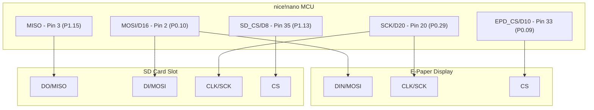

# nice!nano e-Paper Book Reader Wiring Guide

This document details the complete hardware pinout, GPIO assignments, and peripheral wiring schematics for the nice!nano (nRF52840 ProMicro-compatible) e-Paper Book Reader.

---

## 1. Primary Component Pinout Map

| Peripheral Pin | nice!nano Pin (Arduino ID) | nRF52840 Port ID | Silkscreen Pin Label | Pin Function & Description |
| :--- | :---: | :---: | :---: | :--- |
| **E-Paper CS** | `33` | `P0.09` | **D10** | Chip Select (Active Low) |
| **E-Paper DC** | `28` | `P0.20` | **D3** | Data / Command Control Select |
| **E-Paper RST** | `29` | `P0.17` | **D2** | Panel Hardware Reset (Active Low) |
| **E-Paper BUSY** | `23` | `P0.11` | **D7** | Busy State indicator line (Active High) |
| **E-Paper DIN** | `2` | `P0.10` | **D16** | SPI Hardware MOSI Data line |
| **E-Paper CLK** | `20` | `P0.29` | **D20** | SPI Hardware SCK Clock line |
| **E-Paper GND** | GND | — | **GND** | Power Ground connection |
| **E-Paper VCC** | VCC (Switched) | `P1.09` | **D13** | Switched 3.3V Power Line via MOSFET (Pin 13) |

---

## 2. Hardware Button Mappings

Buttons must be wired between the designated GPIO pin and **GND** (Ground). The firmware utilizes internal MCU pull-up resistors (`INPUT_PULLUP`). 

*Note: The Prev and Select buttons are swapped in code to match custom cross-wiring layouts.*

| Button Name | nice!nano Pin (Arduino ID) | nRF52840 Port ID | Silkscreen Pin Label | Button Interaction |
| :--- | :---: | :---: | :---: | :--- |
| **Prev Button** | `18` | `P0.02` | **D19** | Page backward / Scroll up / Decrease menu index |
| **Next Button** | `1` | `P0.24` | **D5** | Page forward / Scroll down / Increase menu index |
| **Select Button** | `30` | `P0.22` | **D4** | Enter menu / Action Select / Hold select to go back |

---

## 3. Switched Power Isolation Circuit (VCC Control)

To eliminate parasitic current draw and ensure deep-sleep efficiency, the display's VCC input is isolated using an external P-channel MOSFET switch controlled by the MCU:

* **Control GPIO**: Digital Pin `13` (`P1.09`)
* **Logic Level**: 
  * `HIGH`: Power enabled (booster grid and display operational).
  * `LOW`: Power completely cut off (removes microamp leakage during deep sleep).
* **Bypass configuration**: If direct VCC control is not desired, configure `#define ENABLE_VCC_CONTROL false` in `Config.h` and connect display VCC directly to the nice!nano 3.3V output pin.

---

## 4. Battery Telemetry Map

The nice!nano firmware supports two methods of battery cell voltage measurement:

### Method A: Internal VDDH Divider (Default & Recommended for Clone Boards)
*   **Measurement Source**: nRF52840's internal high-voltage channel `VDDHDIV5` (`analogReadVDDHDIV5()`).
*   **Functionality**: Measures the input supply voltage directly via the chip's internal 1/5 voltage divider, requiring **no external resistors** on the board.
*   **Conversion Formula**:
    $$\text{Battery Voltage} = \left(\text{Raw ADC} \times \frac{3.0\text{V}}{1024}\right) \times 5.0$$

### Method B: External ADC Resistor Divider (Fallback Path)
*   **Analog Input Pin**: `PIN_BATTERY` maps to `A0` (`P0.04` / `AIN2`).
*   **Hardware Divider**: External 1/2 resistor divider (e.g. dual 1MΩ resistors) scaling battery voltage down below the ADC's max internal reference.
*   **Conversion Formula**:
    $$\text{Battery Voltage} = \left(\text{Raw ADC} \times \frac{3.3\text{V}}{1024}\right) \times 2.0$$

---

## 5. Micro SD Card Slot Wiring (Shared SPI Bus)

To support reading from an exFAT formatted micro SD card, the SD card slot shares the hardware SPI interface with the e-Paper display, utilizing separate Chip Select (CS) pins to prevent bus conflicts. 

*   **SPI Bus Sharing**: MOSI (SDA / DIN) and SCK (SCL / CLK) lines are wired in parallel to both the display and the SD card slot.
*   **MISO Line**: The SD card slot DO (MISO) line must be connected to the nice!nano hardware MISO pin (Pin 24 / silkscreen MISO) so the MCU can read block data. (The display is write-only and does not connect to MISO).
*   **SD CS Pin**: A dedicated digital pin **35** (silkscreen **D8**) is allocated for the SD card's Chip Select.

### Pinout Mapping for SD Card Slot

| SD Card Pin | nice!nano Pin (Arduino ID) | nRF52840 Port ID | Silkscreen Pin Label | Pin Function & Description |
| :--- | :---: | :---: | :---: | :--- |
| **GND** | GND | — | **GND** | Power Ground |
| **VCC** | VCC | — | **VCC / 3V3** | 3.3V Power Supply (Can be connected to display's switched VCC or directly to nice!nano 3.3V) |
| **MISO / DO** | `3` | `P1.15` | **D9** | SPI Master In Slave Out (Data from SD card) |
| **MOSI / DI / SDA** | `2` | `P0.10` | **D16** | SPI Master Out Slave In (Data to SD card) - *Shared with Display DIN* |
| **SCK / CLK / SCL** | `20` | `P0.29` | **D20** | SPI Clock line - *Shared with Display CLK* |
| **CS** | `35` | `P1.13` | **D8** | Dedicated SD Chip Select (Active Low) |

### Complete Shared SPI Topology Diagram

